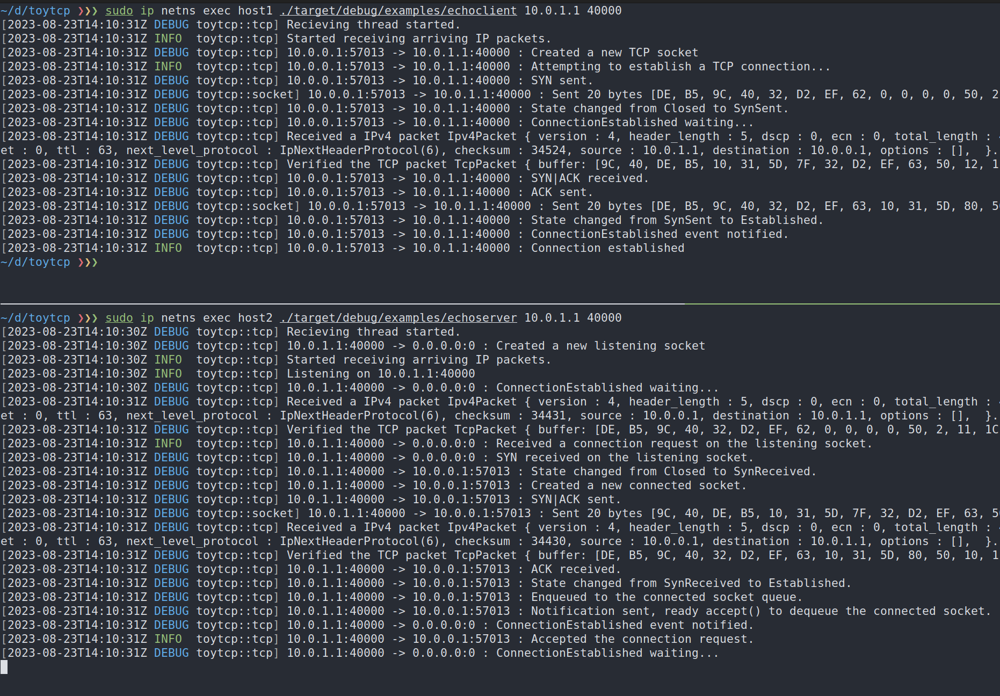

# toytcp

A subset implementation of TCP based on RFC793.

Currently only 3-way handshake are implemented.

Inspired by
- https://techbookfest.org/product/6562563816947712
- https://github.com/teru01/toytcp

## setup

Ubuntu 22.04 LTS.

```bash
# setup network.
sudo apt install ethtool
./setup.sh

# launch packet capture tool.
sudo ip netns exec host1 wireshark
# or
sudo ip netns exec host1 tcpdump -l
```

Network topology:
```
+++++++++++++++ .1  .254 +++++++++++++++ .254  .1 +++++++++++++++
+             +          +             +          +             +
+ host1-veth1 ++++++++++++    router   ++++++++++++ host2-veth1 +
+             +          +             +          +             +
+++++++++++++++          +++++++++++++++          +++++++++++++++

            10.0.0.0/24                     10.0.1.0/24
```

### run examples

- echoserver listens on 10.0.1.1:40000 (passive open).
- echoclient connects to echoserver (active open).

```bash
sudo ip netns exec host2 ./target/debug/examples/echoserver 10.0.1.1 40000
sudo ip netns exec host1 ./target/debug/examples/echoclient 10.0.1.1 40000
```

### log


